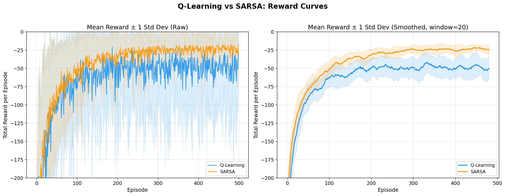
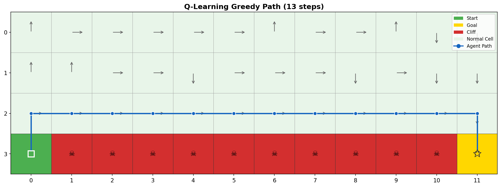
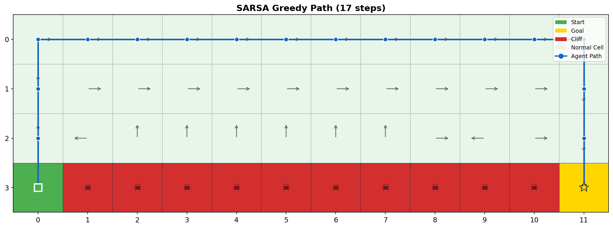
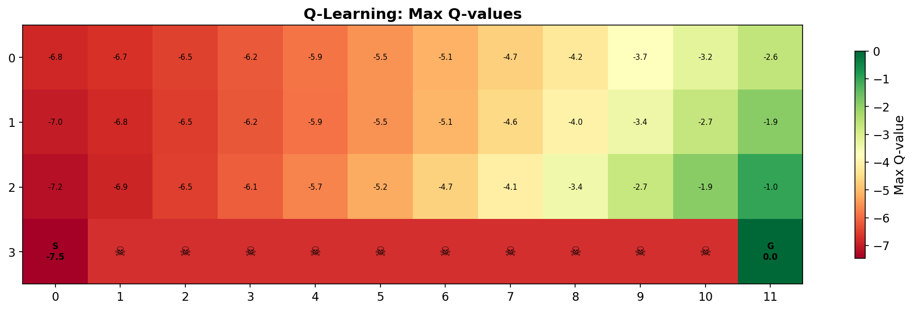
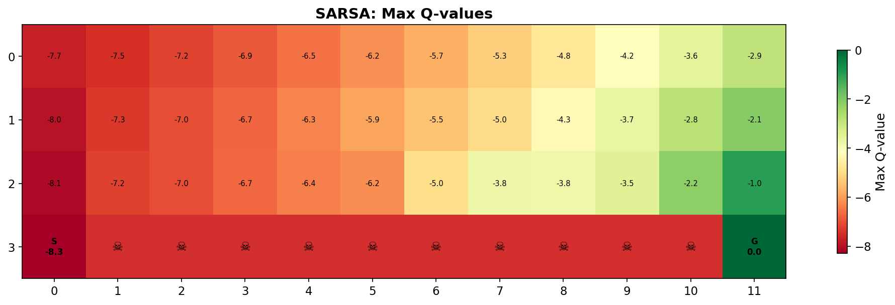

# 強化學習作業報告：Q-learning 與 SARSA 之比較分析

## 一、 作業目的
本作業旨在透過實作經典的 Cliff Walking（懸崖行走）環境，比較離策略（Off-policy）演算法 Q-learning 與同策略（On-policy）演算法 SARSA 的學習表現、收斂速度及策略選擇差異。

## 二、 演算法原理簡述

### 1. Q-learning (Off-policy)
Q-learning 的更新公式如下：
$$Q(s, a) \leftarrow Q(s, a) + \alpha [r + \gamma \max_{a'} Q(s', a') - Q(s, a)]$$

Q-learning 屬於**離策略（Off-policy）**方法。其更新時總是假設下一狀態會採取「最佳動作」（$\max Q$），即使實際執行的動作是基於探索策略（如 $\epsilon$-greedy）選出的。這種解耦使得 Q-learning 能夠直接逼近最優策略的價值函數，不受行為策略（behavior policy）中探索動作的影響。

### 2. SARSA (On-policy)
SARSA 的更新公式如下：
$$Q(s, a) \leftarrow Q(s, a) + \alpha [r + \gamma Q(s', a') - Q(s, a)]$$

SARSA 屬於**同策略（On-policy）**方法。其更新時使用的是「實際採取的下一個動作」$a'$（也由 $\epsilon$-greedy 策略選出）。這意味著 SARSA 的價值評估會將探索策略（Exploration）帶來的風險納入考量，因此學到的 Q 值會反映在當前策略下的實際表現，傾向於學習更穩健、安全的策略。

## 三、 實驗設定
- **環境：** 4 × 12 格子世界（Cliff Walking）
- **參數設定：**
  - 學習率 ($\alpha$): 0.1
  - 折扣因子 ($\gamma$): 0.9
  - 探索率 ($\epsilon$): 0.1
  - 訓練回合數: 500 回合
  - 獨立實驗次數: 30 次（用於統計分析）
- **獎勵機制：**
  - 一般移動: −1
  - 掉入懸崖: −100（回起點）
  - 到達終點: −1（回合結束）
- **環境佈局：**
  ```
  Row 0: [ ][ ][ ][ ][ ][ ][ ][ ][ ][ ][ ][ ]
  Row 1: [ ][ ][ ][ ][ ][ ][ ][ ][ ][ ][ ][ ]
  Row 2: [ ][ ][ ][ ][ ][ ][ ][ ][ ][ ][ ][ ]
  Row 3: [S][C][C][C][C][C][C][C][C][C][C][G]
  ```
  S = 起點 (3,0)、G = 終點 (3,11)、C = 懸崖

## 四、 結果分析

### 1. 學習表現與收斂速度

下圖展示了 30 次獨立實驗的平均獎勵曲線（含 ±1 標準差範圍）：



**關鍵觀察：**
- **SARSA** 在約第 229 回合後穩定收斂，平均獎勵達到 −23.49 ± 3.66
- **Q-learning** 收斂過程波動較大，最終平均獎勵為 −48.34 ± 9.47

SARSA 的線上表現（online performance）明顯優於 Q-learning，這是因為 SARSA 學會避開高風險區域，使得在 ε-greedy 策略下的實際執行更加穩定。

### 2. 策略行為比較

#### Q-Learning 學習到的策略路徑（13 步）：


路徑：`(3,0) → (2,0) → (2,1) → ... → (2,11) → (3,11)`

Q-learning 學到的是**最短路徑**，沿著懸崖邊緣（Row 2）直行。這是理論最優路徑（13步 × −1 = −13），但在 ε-greedy 探索下，有 10% 的機率執行隨機動作，極易掉入懸崖受到 −100 的重大懲罰。這體現了 Q-learning 的**冒險傾向**。

#### SARSA 學習到的策略路徑（17 步）：


路徑：`(3,0) → (2,0) → (1,0) → (0,0) → (0,1) → ... → (0,11) → (1,11) → (2,11) → (3,11)`

SARSA 選擇了一條**遠離懸崖的安全路徑**，沿最頂部（Row 0）行走。雖然路徑較長（17步），但完全避免了因探索導致掉入懸崖的風險。這體現了 SARSA 的**保守傾向**。

### 3. Q 值分佈分析

#### Q-Learning 的 Q 值熱力圖：


#### SARSA 的 Q 值熱力圖：


**觀察：**
- 兩者的 Q 值均呈現從左到右遞增的梯度，反映了「越接近終點，價值越高」的特性
- Q-learning 在 Row 2（靠近懸崖）的 Q 值較高，顯示它認為這條路線「最優」
- SARSA 在 Row 2 的 Q 值偏低，反映了它考慮到 ε-greedy 探索可能掉入懸崖的風險

### 4. 穩定性分析（量化）

| 指標 | Q-Learning | SARSA |
|------|-----------|-------|
| 最後 50 回合平均獎勵 | −48.34 ± 9.47 | −23.49 ± 3.66 |
| 回合內標準差（平均） | 67.37 | 20.80 |
| 變異係數（CV） | 1.4059 | 0.8408 |
| 收斂回合（獎勵 > −30） | 未穩定收斂 | ~229 |
| Greedy 路徑步數 | 13 | 17 |

**結論：** SARSA 的穩定性顯著優於 Q-learning（CV 低 40%，回合內變異低 69%）。Q-learning 即使在後期訓練中仍有頻繁的大幅獎勵下跌，這是因為其學到的路徑緊鄰懸崖，探索動作極易導致掉入。

## 五、 理論比較與討論

### Off-policy vs On-policy 的核心差異

| 特性 | Q-learning (Off-policy) | SARSA (On-policy) |
|------|------------------------|-------------------|
| 更新依據 | 下一狀態的最佳動作 $\max_{a'} Q(s', a')$ | 實際採取的動作 $Q(s', a')$ |
| 學習目標 | 最優策略的價值函數 | 當前行為策略的價值函數 |
| 探索影響 | 更新不受探索策略影響 | 更新反映探索策略的風險 |
| 策略傾向 | 理論最優（可能冒險） | 實際安全（可能次優） |

### 為何 Q-learning 學到最短路徑但表現較差？

Q-learning 的 $\max$ 運算使其「樂觀地」評估每個狀態的價值——它假設未來總是做出最佳選擇。因此，懸崖邊緣的 Q 值被高估（因為不考慮 10% 隨機動作掉入懸崖的風險），導致 agent 學到沿懸崖走的路線。

然而在實際執行（含 ε-greedy 探索）時，這條路線的實際表現遠低於預期，因為每一步都有 10% 的機率掉入懸崖承受 −100 的懲罰。

### 為何 SARSA 學到較長但更安全的路線？

SARSA 使用「實際動作」更新 Q 值，因此探索動作（包括隨機動作掉入懸崖）的懲罰會直接反映在靠近懸崖位置的 Q 值中。經過多次學習後，agent 發現遠離懸崖的路線雖然步數較多（−17），但避免了掉入懸崖的風險，實際累積獎勵更高。

## 六、 結論

### 1. 收斂速度
在此環境下，**SARSA 收斂更快且更穩定**。SARSA 約在第 229 回合達到穩定，而 Q-learning 的獎勵曲線在 500 回合後仍存在劇烈波動。

### 2. 穩定性
**SARSA 明顯更穩定**。其變異係數（0.84）遠低於 Q-learning（1.41），回合內獎勵波動也小得多。

### 3. 最優性
**Q-learning 學到理論最優路徑**（13 步），但在包含探索的實際執行中表現不佳。SARSA 學到的路徑（17 步）雖非最短，但在 ε-greedy 策略下的期望總獎勵更高。

### 4. 應用場景建議

| 場景 | 推薦演算法 | 原因 |
|------|----------|------|
| 模擬環境（可大量試錯） | **Q-learning** | 能找到理論最優策略 |
| 真實系統（失誤代價高） | **SARSA** | 學習過程更安全穩定 |
| 探索率可退火到 0 | **Q-learning** | ε→0 時最優路徑即最佳 |
| 需要持續探索 | **SARSA** | 策略考慮探索風險 |

## 七、 程式架構

| 檔案 | 功能 |
|------|------|
| `cliff_walking.py` | Cliff Walking 環境實作 |
| `agents.py` | Q-learning 與 SARSA Agent 類別 |
| `train.py` | 訓練腳本（支援多次獨立實驗） |
| `analysis.py` | 分析與視覺化 |
| `results.pkl` | 訓練結果資料 |
| `hw2_report.pdf` | 實驗報告 |
